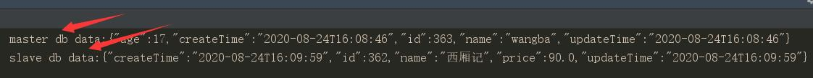

### 依赖mybatis使用注解其**DS**注解的方式配置多数据源

#### 1.引入依赖
```xml
        <!--Mybatis plus基础包-->
        <dependency>
            <groupId>com.baomidou</groupId>
            <artifactId>mybatis-plus-boot-starter</artifactId>
            <version>3.3.1</version>
        </dependency>

        <!--Mybtis plus 多数据源支持依赖包-->
        <dependency>
            <groupId>com.baomidou</groupId>
            <artifactId>dynamic-datasource-spring-boot-starter</artifactId>
            <version>3.2.0</version>
        </dependency>

        <!--mysql数据取依赖包-->
        <dependency>
            <groupId>mysql</groupId>
            <artifactId>mysql-connector-java</artifactId>
            <version>8.0.20</version>
        </dependency>
```
#### 2.配置文件种配置多个数据源
```yaml
spring:
  datasource:
    dynamic:
      hikari:
        connection-timeout: 30000
        max-lifetime: 1800000
        max-pool-size: 15
        min-idle: 5
        connection-test-query: select 1
        pool-name: TestHikariCP
      # 设置默认的主数据源,名称为下列数据源中的一个
      primary: master
      datasource:
        #多数据源的名称,可以随意取,对应上述种的primary
        master:
          url: jdbc:mysql://rm-2ze637fn3mu1445zgqo.mysql.rds.aliyuncs.com:3306/mult-ds1?useUnicode=true&characterEncoding=UTF-8&useJDBCCompliantTimezoneShift=true&useLegacyDatetimeCode=false&serverTimezone=GMT%2b8
          username: dtsuser
          password: Dtsuser123
          driver-class-name: com.mysql.cj.jdbc.Driver
        slave1:
          url: jdbc:mysql://rm-2ze637fn3mu1445zgqo.mysql.rds.aliyuncs.com:3306/mult-ds2?useUnicode=true&characterEncoding=UTF-8&useJDBCCompliantTimezoneShift=true&useLegacyDatetimeCode=false&serverTimezone=GMT%2b8
          username: dtsuser
          password: Dtsuser123
          driver-class-name: com.mysql.cj.jdbc.Driver
```

#### 3.根据配置文件以及数据库表写mapper,entity,service

- 在mapper类上添加**DS**注解,也可以在service类或者方法上使用此注解,但是建议在mapper上,因为紧耦合具体数据库的表
```java
@DS("master")
public interface UserMapper extends BaseMapper<UserEntity> {
}
```
```java
@DS("slave1")
public interface BookMapper extends BaseMapper<BookEntity> {
}
```

#### 4.测试用例查看
```java
  @Test
  void dsAnnotationTest() {
      log.info("master db data:" + JSON.toJSONString(userService.getAll().get(0)));
      log.info("slave db data:" + JSON.toJSONString(bookService.getAll().get(0)));
      log.info("combine db data:" + combineService.getAll());
  }  
```

#### 5.结果
