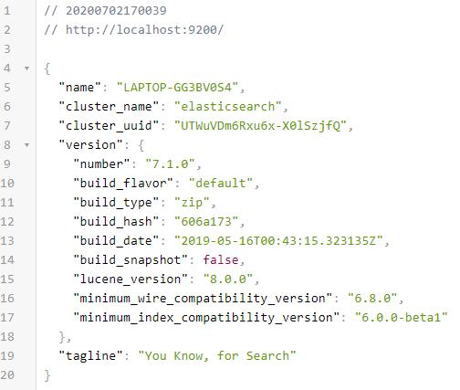
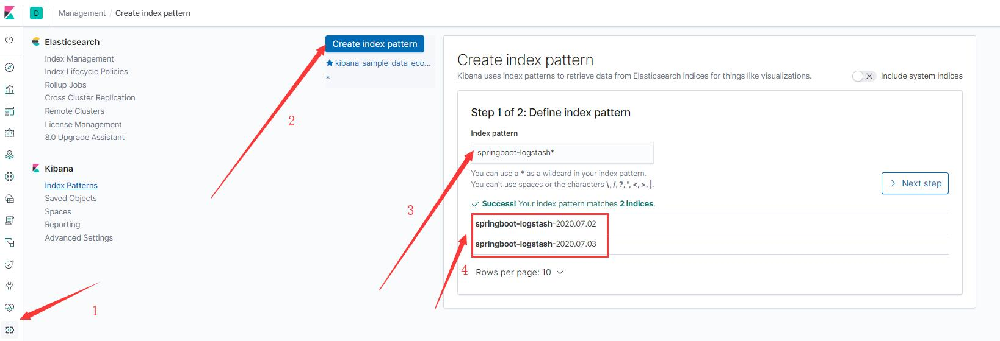

# elk
* Elasticsearch:是一种基于JSON的分布式搜索和分析引擎，提供水平可扩展性，为高可靠性和易管理性而设计
* Logstash:是一个动态数据收集管道，具有可扩展的插件生态系统和强大的Elasticsearch协同作用
* Kibana:通过 UI 提供数据可视化 

## 1.windows10上部署单机版elk
### 1.1 环境版本

序号 | 名称 | 版本
---|---|---
1|JDK|1.8
2|ES|7.1.0
3|kibana|7.1.0
4|logstash|7.1.0

> [快速下载地址](https://mirrors.huaweicloud.com/)

### 1.2 es安装启动
* 在命令提示符下运行bin\elasticsearch.bat
* 默认情况下，它可从http://localhost:9200开始访问
* 启动成功页面如下：


### 1.3 Logstash安装启动
* 根据配置说明创建一个文件logstash.conf，需要与项目中的配置文件配合，配置文件如下
```editorconfig
input{
  tcp {
    mode => "server"
    host => "0.0.0.0"
    port => 4560
    codec => json_lines
  }
}
output {
  elasticsearch {
    hosts => "localhost:9200"
    index => "springboot-logstash-%{+YYYY.MM.dd}"
  }
}
```
* 进入到config文件夹下，运行bin/logstash -f logstash.conf以启动logstash;
### 1.4 kibana安装与启动
* 在编辑器中打开config/kibana.yml，本测试项目打开如下配置：
```yaml
server.port: 5601
server.host: "localhost"
elasticsearch.hosts: ["http://localhost:9200"]
```
* 访问主页面地址：访问http://localhost:5601

## 2.项目日志配置
### 2.1 日志收集方式：应用使用logback直接通过tcp的方式发送日志到logstash
* pom需要依赖
```xml
<dependency>
            <groupId>net.logstash.logback</groupId>
            <artifactId>logstash-logback-encoder</artifactId>
            <version>5.3</version>
        </dependency>
```
* 日志配置：
```xml
<?xml version="1.0" encoding="UTF-8"?>
<configuration>
    <include resource="org/springframework/boot/logging/logback/base.xml" />

    <appender name="LOGSTASH" class="net.logstash.logback.appender.LogstashTcpSocketAppender">
        <destination>127.0.0.1:4560</destination>
        <!-- 日志输出编码 -->
        <encoder charset="UTF-8"
                class="net.logstash.logback.encoder.LoggingEventCompositeJsonEncoder">
            <providers>
                <timestamp>
                    <timeZone>UTC</timeZone>
                </timestamp>
                <pattern>
                    <pattern>
                        {
                        "logLevel": "%level",
                        "serviceName": "${springAppName:-}",
                        "pid": "${PID:-}",
                        "thread": "%thread",
                        "class": "%logger{40}",
                        "rest": "%message"
                        }
                    </pattern>
                </pattern>
            </providers>
        </encoder>
    </appender>

    <root level="INFO">
        <appender-ref ref="LOGSTASH" />
        <appender-ref ref="CONSOLE" />
    </root>
</configuration>
```
> 注意：上述的**destination**一定要指定logstash的启动地址

## 3.配置索引
### 3.1 进入kibana添加索引如下图所示

* 标记4：指代需要建索引的indices，indices是elasticsearch中的术语，可以理解为mysql中的数据表。此出列表中展示的名称对应着**1.3 
Logstash安装启动**配置文件中的**output-index**中设置的输出文件名
* 标记3：index pattern是针对标记4列表中的日志文件建立索引


## 参考文档
* [微服务中的日志管理 — ELK](https://blog.csdn.net/peterwanghao/article/details/86595765)
* [SpringBoot使用ELK日志收集](https://my.oschina.net/u/3480797/blog/3020716)

