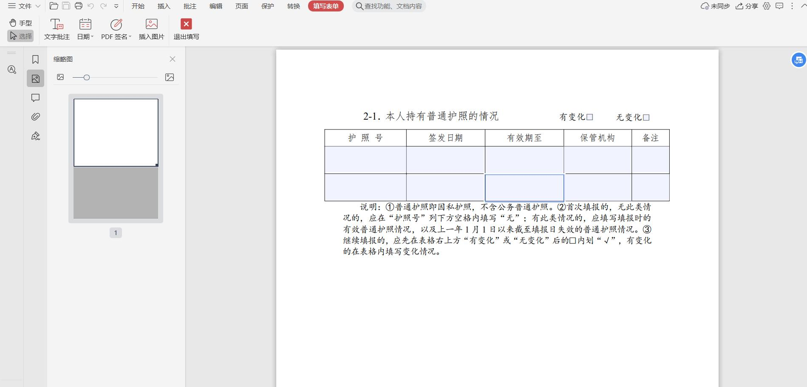
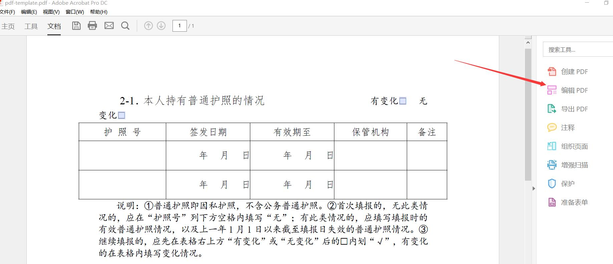
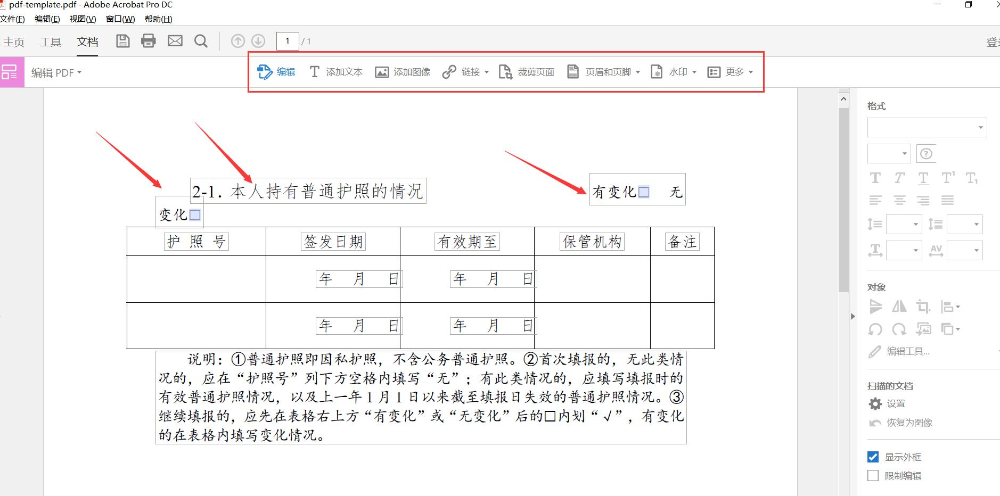
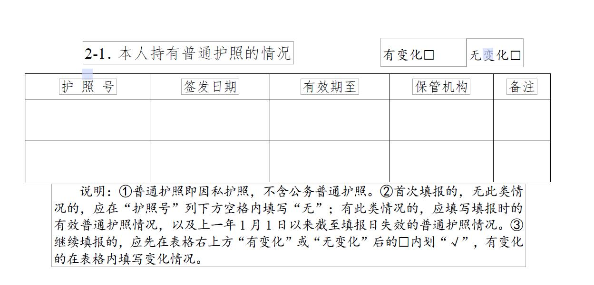
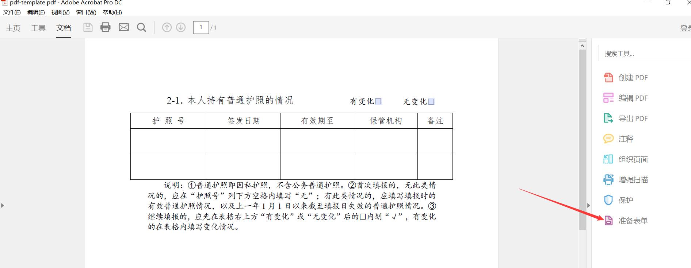
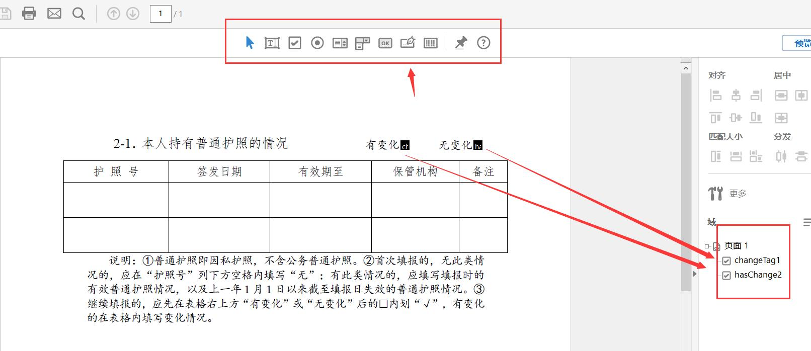
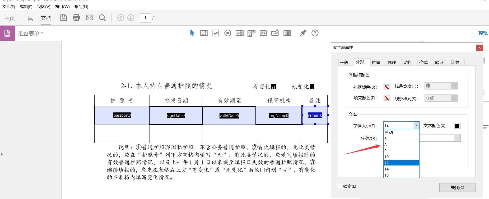
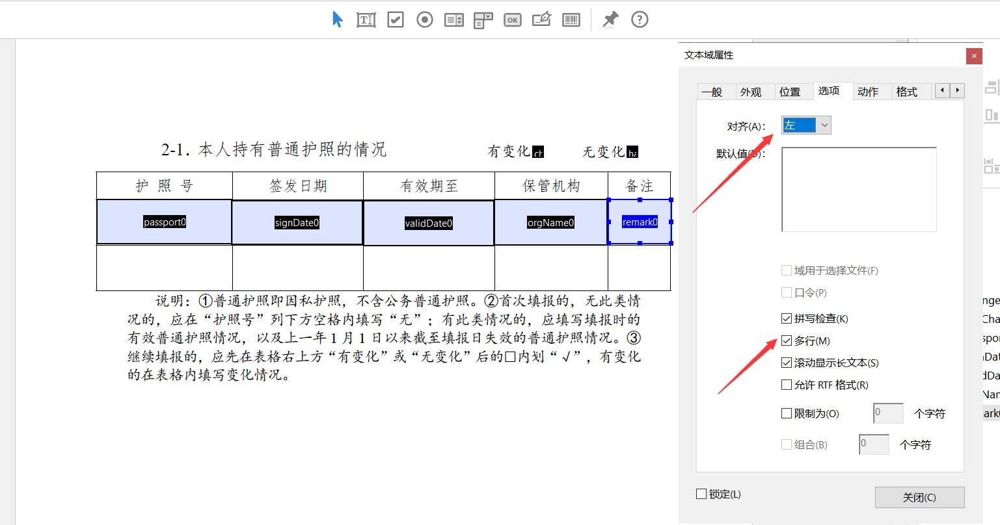
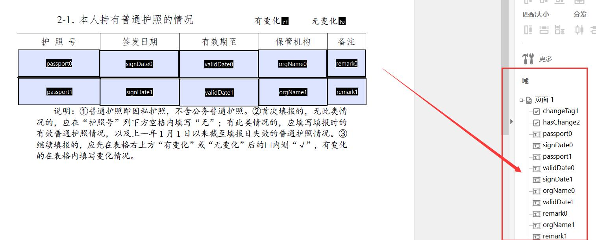
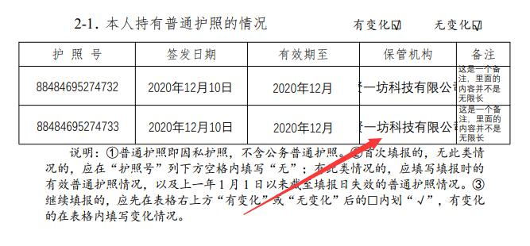

#### PDF模板数据填充
##### 一.思路
根据业务需求，获取实际业务数据，借助itext库功能，将业务数据填充入提前制作好的PDF模板中

##### 二.操作步骤
- 制作PDF模板:提前下载好**Adobe Acrobat Pro DC**
- 效果展示

#### 1.准备PDF,如下图

#### 2.编辑PDF



#### 3.准备表单


#### 4.设置字体

#### 5.设置多行

#### 6.模板表单标签

#### 7.标签绑定具体业务数据
- pom依赖
```xml
<dependency>
    <groupId>com.itextpdf</groupId>
    <artifactId>itextpdf</artifactId>
    <version>5.5.10</version>
</dependency>
<dependency>
    <groupId>com.itextpdf</groupId>
    <artifactId>itext-asian</artifactId>
    <version>5.2.0</version>
</dependency>

<dependency>
    <groupId>cn.hutool</groupId>
    <artifactId>hutool-all</artifactId>
</dependency>
```
- 具体实现
```java
private ByteArrayOutputStream getYearData() {
        ClassPathResource classPathResource = new ClassPathResource("template/pdf-template.pdf");
        PdfReader reader;
        ByteArrayOutputStream bos = new ByteArrayOutputStream();
        try {
            reader = new PdfReader(classPathResource.getStream());
            bos = new ByteArrayOutputStream();
            PdfStamper stamper = new PdfStamper(reader, bos);
            AcroFields form = stamper.getAcroFields();
            Map<String, String> map = new HashMap<>();
            map.put("changeTag1", ReportConstant.CHOOSE_FLAG);
            map.put("changeTag2", ReportConstant.CHOOSE_FLAG);
            map.put("passport0", "88484695274732");
            map.put("passport1", "88484695274733");
            map.put("signDate0", DateUtil.format(new Date(), ReportConstant.DATE_FORMAT_YMS));
            map.put("signDate1", DateUtil.format(new Date(), ReportConstant.DATE_FORMAT_YMS));
            map.put("validDate0", DateUtil.format(new Date(), ReportConstant.DATE_FORMAT_YM));
            map.put("validDate1", DateUtil.format(new Date(), ReportConstant.DATE_FORMAT_YM));
            map.put("orgName0", "贤一坊科技有限公司");
            map.put("orgName1", "贤一坊科技有限公司");
            map.put("remark0", "这是一个备注，里面的内容并不是无限长");
            map.put("remark1", "这是一个备注，里面的内容并不是无限长");

            this.fillPdfCellForm(map, form);

            // true代表生成的PDF文件不可编辑
            stamper.setFormFlattening(true);
            stamper.close();
        } catch (IOException e) {
            e.printStackTrace();
        } catch (DocumentException e) {
            e.printStackTrace();
        }

        return bos;
    }

    private void fillPdfCellForm(Map<String, String> map, AcroFields form) throws IOException, DocumentException {
        for (Map.Entry entry : map.entrySet()) {
            String key = (String) entry.getKey();
            String value = (String) entry.getValue();
            form.setField(key, value);
        }
    }
```
#### 8.效果展示



#### 参考文档
- [java使用itext操作填充pdf模板，（根据一个模板生成多页数据）](https://blog.csdn.net/weixin_36049035/article/details/82909917)
- [Java向PDF模板写入数据](https://my.oschina.net/aijiaoer0624/blog/1921113?tdsourcetag=s_pcqq_aiomsg)
- [java之数据填充PDF模板](https://www.cnblogs.com/ywjfx/p/10908316.html)

- [Java生成PDF文件](https://www.cnblogs.com/qlqwjy/p/8213989.html)
- [office收费工具](https://www.e-iceblue.cn/licensing/install-spirepdf-for-java-from-maven-repository.html)
